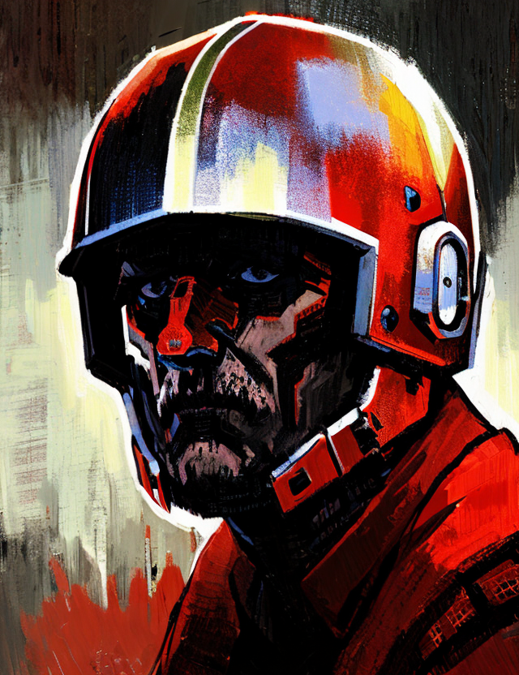

<!-- Projeto Finalizado -->
# 🎨 DIO: Uncanny Visions

  

## 🎯 Objetivo do Projeto
O **"Uncanny Visions"** é uma coleção de NFTs inspirada em uma história ainda não lançada. Desenvolvido como parte de um bootcamp da **DIO** em colaboração com a **Binance**, este projeto dá vida a personagens, cenários e artefatos únicos, capturando a essência de um thriller psicológico de fantasia.

## 🌐 Links
- **Site da Coleção:** [Uncanny Visions no OpenSea](https://opensea.io/collection/uncanny-visions)

## 🛠 Tecnologias Empregadas
- **[OpenSea](https://opensea.io/)**: Plataforma de marketplace para a visualização e negociação de NFTs, utilizada para listar e exibir a coleção de **Uncanny Visions**.
- **[Invoke AI](https://app.invoke.ai/)**: Ferramenta de geração de imagens com inteligência artificial, utilizada para criar as imagens dos NFTs da coleção.
- **[Base](https://base.org/)**: Rede Ethereum Layer 2 empregada para a criação e negociação dos NFTs da coleção.

## 🔍 Detalhes da Coleção
A coleção **"Uncanny Visions"** é composta por:
- **Personagens:** NFTs que retratam figuras icônicas da história, como o artista de sunga com um capacete de abóbora, o corvo humanóide, o guarda Mason e a garota misteriosa.
- **Cenários:** NFTs que ilustram locais marcantes da trama, como a prisão, a floresta das árvores retorcidas, o castelo medieval e a cidade.
- **Artefatos:** NFTs que representam itens mágicos e poderosos, como a espada do guarda, a poção mágica, a funda e a "janela" que conecta mundos.

## 📝 Nota
Este projeto é apenas uma atividade da **DIO** em parceria com a **Binance**.

 

---

  Desenvolvido por <a href="https://github.com/seuUsuario">Ricardo Andreotti Gonçalves</a> 🧑‍💻

---
